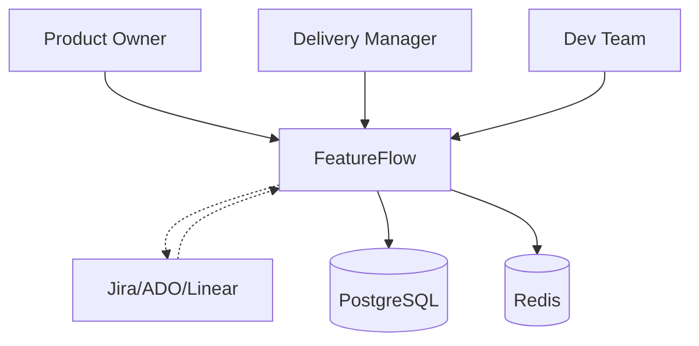
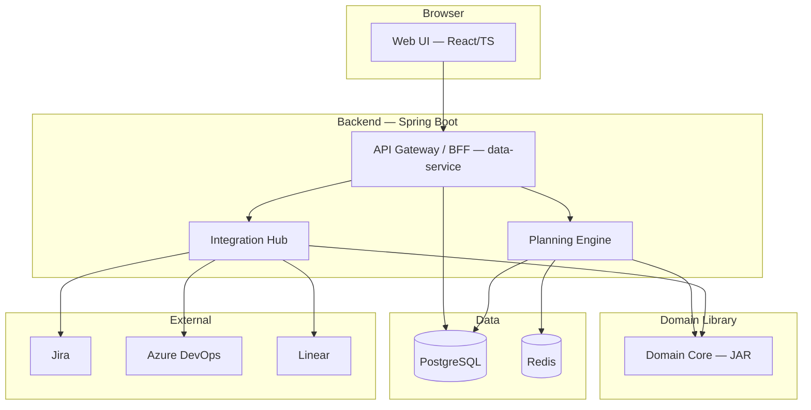

# FeatureFlow — Master Plan

> Платформа интеллектуального планирования портфеля разработки ПО
> 
> **Стек:** Java 25 + Spring Boot 3.4 + React 19/TypeScript + PostgreSQL 16 + Redis 7
> **Scope:** Полная реализация (8 спринтов)

---

## 1. Архитектурное видение

### 1.1 Описание системы

FeatureFlow — система автоматизированного планирования разработки новых фич для организаций с множеством кросс-функциональных команд и бизнес-заказчиков.

**Цели:**
- Минимизация Time-to-Market (TTM)
- Минимизация простоев и неравномерности загрузки команд
- Прозрачное перестраиваемое планирование с учётом ограничений
- Симуляция сценариев «что-если»

### 1.2 C4 Level 1 — Context Diagram



**Акторы:**
| Актор | Роль |
|-------|------|
| Product Owner | Создаёт/приоритизирует фича-реквесты |
| Delivery Manager | Управляет командами, запускает планирование, корректирует план |
| Dev Team Lead | Обновляет капасити, состав команды |
| Jira/ADO/Linear | Внешние трекеры — импорт/экспорт данных |

### 1.3 Ключевые архитектурные характеристики

| Характеристика | Требование |
|----------------|------------|
| Производительность | Планирование 500 фич / 50 команд < 30 сек |
| Масштабируемость | Горизонтальное масштабирование планировщика |
| Точность | Стохастические оценки, Монте-Карло |
| Доступность | 99.5% uptime |

---

## 2. C4 Level 2 — Container Diagram



### 2.1 Контейнеры

| Контейнер | Технология | Ответственность |
|-----------|------------|-----------------|
| **Web UI** | React 19 + TypeScript + Vite | SPA: Gantt, дашборды, формы, drag-and-drop |
| **data-service** | Spring Boot 3.4 (Java 25) | CRUD API, BFF, управление сущностями, PostgreSQL |
| **planning-engine** | Spring Boot 3.4 (Java 25) | Алгоритмы: greedy, simulated annealing, Monte Carlo |
| **integration-hub** | Spring Boot 3.4 (Java 25) | Коннекторы к Jira/ADO/Linear, импорт/экспорт |
| **domain-core** | Java 25 Library (JAR) | Доменные сущности, правила, валидация — без фреймворков |
| **PostgreSQL** | 16 | Реляционное хранение, JSONB для гибких оценок |
| **Redis** | 7 | Кэш планов, очередь задач, сессии |

### 2.2 Взаимодействия

| From | To | Протокол | Синх/Асинх |
|------|----|----------|------------|
| Web UI | data-service | REST/HTTP | Sync |
| data-service | planning-engine | REST/HTTP + SSE | Sync + Async (SSE для статуса) |
| data-service | integration-hub | REST/HTTP | Sync |
| planning-engine | domain-core | Java API (in-process) | Sync |
| integration-hub | domain-core | Java API (in-process) | Sync |
| planning-engine | Redis | RESP | Sync |

---

## 3. Структура репозитория

```
featureflow/
├── pom.xml                          # Multi-module parent
├── domain-core/                     # JAR — доменная логика
│   ├── pom.xml
│   └── src/main/java/com/featureflow/domain/
│       ├── entity/                  # Product, Team, Feature, Assignment
│       ├── valueobject/             # EffortEstimate, Capacity, Role
│       ├── rules/                   # Validation rules, constraints
│       └── planning/                # Algorithm interfaces
├── data-service/                    # Spring Boot — CRUD API
│   ├── pom.xml
│   └── src/main/java/com/featureflow/data/
│       ├── controller/              # REST endpoints
│       ├── service/                 # Business services
│       ├── repository/              # Spring Data JPA
│       └── config/                  # Spring config
├── planning-engine/                 # Spring Boot — алгоритмы
│   ├── pom.xml
│   └── src/main/java/com/featureflow/planning/
│       ├── greedy/                  # Жадный алгоритм
│       ├── annealing/               # Имитация отжига
│       ├── monteCarlo/              # Монте-Карло симуляция
│       └── service/                 # Planning orchestration
├── integration-hub/                 # Spring Boot — интеграции
│   ├── pom.xml
│   └── src/main/java/com/featureflow/integration/
│       ├── jira/                    # Jira connector
│       ├── ado/                     # Azure DevOps connector
│       ├── linear/                  # Linear connector
│       └── model/                   # External data models
├── web-ui/                          # React + TypeScript
│   ├── package.json
│   ├── tsconfig.json
│   └── src/
│       ├── components/
│       ├── pages/
│       ├── services/                # API client
│       └── types/
├── plan/                            # Этот план
│   ├── specs/
│   └── ...
└── docker/
    ├── docker-compose.yml
    └── Dockerfile.*
```

---

## 4. Детали спецификаций

Каждый сервис описан в отдельном файле в `plan/specs/`:

| Файл | Содержание |
|------|------------|
| [domain-core.md](plan/specs/domain-core.md) | Доменные сущности, value objects, бизнес-правила |
| [planning-engine.md](plan/specs/planning-engine.md) | Greedy, Simulated Annealing, Monte Carlo алгоритмы |
| [data-service.md](plan/specs/data-service.md) | REST API, Spring Data JPA, сервисы |
| [integration-hub.md](plan/specs/integration-hub.md) | Коннекторы Jira/ADO/Linear |
| [web-ui.md](plan/specs/web-ui.md) | React компоненты, страницы, routing |
| [api-contracts.md](plan/specs/api-contracts.md) | OpenAPI спецификации, примеры запросов/ответов |
| [data-model.md](plan/specs/data-model.md) | PostgreSQL схема, индексы, миграции |

---

## 5. Нефункциональные требования

### 5.1 Производительность
- Планирование 500 фич / 50 команд < 30 сек
- Virtual threads для I/O-bound операций
- Redis кэш для часто запрашиваемых планов
- PostgreSQL индексы по foreign keys и часто используемым полям

### 5.2 Масштабируемость
- Planning Engine масштабируется горизонтально для параллельных симуляций
- Redis как shared state для распределённых вычислений
- Stateless сервисы — легкое масштабирование в Kubernetes

### 5.3 Безопасность
- Spring Security + JWT
- RBAC: ADMIN, DELIVERY_MANAGER, PRODUCT_OWNER, TEAM_LEAD
- Валидация всех входных данных
- Защита от SQL injection (JPA parameterized queries)

### 5.4 Мониторинг
- Spring Boot Actuator: /health, /metrics, /info
- Micrometer + Prometheus
- Structured logging (JSON)
- Distributed tracing (OpenTelemetry)

### 5.5 Конфигурация
```yaml
# application.yml ключевые параметры
featureflow:
  planning:
    annealing:
      initial-temperature: 1000.0
      cooling-rate: 0.95
      min-temperature: 0.1
      max-iterations: 10000
    weights:
      w1-ttm: 1.0
      w2-underutilization: 0.5
      w3-deadline-penalty: 2.0
  capacity:
    default-focus-factor: 0.7
    default-bug-reserve: 0.20
    default-techdebt-reserve: 0.10
  parallelism:
    max-features-per-team-per-sprint: 3
```

---

## 6. Инфраструктура и развёртывание

### 6.1 Docker Compose (dev)
```yaml
services:
  postgres:
    image: postgres:16
    environment:
      POSTGRES_DB: featureflow
      POSTGRES_USER: ff
      POSTGRES_PASSWORD: ff_secret
    ports: ["5432:5432"]
    volumes: ["pgdata:/var/lib/postgresql/data"]
  
  redis:
    image: redis:7-alpine
    ports: ["6379:6379"]
  
  data-service:
    build: ./data-service
    ports: ["8080:8080"]
    depends_on: [postgres, redis]
  
  planning-engine:
    build: ./planning-engine
    ports: ["8081:8081"]
    depends_on: [postgres, redis]
  
  integration-hub:
    build: ./integration-hub
    ports: ["8082:8082"]
    depends_on: [postgres]
  
  web-ui:
    build: ./web-ui
    ports: ["3000:80"]
    depends_on: [data-service]

volumes:
  pgdata:
```

### 6.2 CI/CD (GitHub Actions)
```yaml
# .github/workflows/ci.yml
name: CI/CD
on: [push, pull_request]
jobs:
  test:
    runs-on: ubuntu-latest
    steps:
      - uses: actions/checkout@v4
      - uses: actions/setup-java@v4
        with: { java-version: '25', distribution: 'temurin' }
      - run: mvn test
      - run: mvn verify -Pintegration-test
  build:
    needs: test
    runs-on: ubuntu-latest
    steps:
      - uses: actions/checkout@v4
      - run: docker compose build
      - run: docker compose push
  deploy:
    needs: build
    if: github.ref == 'refs/heads/main'
    runs-on: ubuntu-latest
    steps:
      - run: kubectl apply -f k8s/
```

---

## 7. План итераций

| Спринт | Длительность | Задачи | Критерий приёмки |
|--------|-------------|--------|------------------|
| **Sprint 0** | 1 нед | Модель данных, API контракты, заглушки, CI/CD | Компилируется, тесты green |
| **Sprint 1** | 2 нед | CRUD: продукты, команды, фичи, календари. Базовый UI | Все CRUD операции через UI |
| **Sprint 2** | 2 нед | Жадный алгоритм, отображение Ганта | План строится, Ганта отображает |
| **Sprint 3** | 2 нед | Имитация отжига, сравнение планов | Оптимизация улучшает cost на 10%+ |
| **Sprint 4** | 2 нед | Монте-Карло, вероятностные прогнозы | Вероятность дедлайна для каждой фичи |
| **Sprint 5** | 2 нед | Jira интеграция, классы обслуживания, конфликты | Импорт из Jira работает |
| **Sprint 6** | 2 нед | What-if симуляции, разрешения, отчёты | Ветка плана, сравнение с baseline |
| **Sprint 7** | 1 нед | Тесты, оптимизация, документация | 80%+ coverage, perf < 30 сек |

---

## 8. Риски и сложные места

| Риск | Вероятность | Влияние | Митигация |
|------|------------|---------|-----------|
| Алгоритм отжига не сходится | Средняя | Высокое | Tuning параметров, fallback на greedy |
| Оценки фич неточные | Высокая | Среднее | Монте-Карло, трёхточечные оценки |
| Зависимости между фичами создают deadlock | Средняя | Высокое | Topological sort + cycle detection |
| Контекст-свитчинг не учтён | Средняя | Среднее | Hard limit: max 3 фичи/команда/спринт |

---

## 9. Для агентов-разработчиков

### Как использовать этот план
1. Прочитать этот PLAN.md для общего понимания
2. Перейти к нужной спецификации в `plan/specs/`
3. Следовать структуре и контрактам из спецификации
4. Задавать вопросы при неоднозначностях

### Правила разработки
- Java 25: records, sealed classes, pattern matching, virtual threads
- Spring Boot 3.4: virtual threads, Testcontainers, Actuator
- React 19: functional components, hooks, TypeScript strict mode
- Каждый PR: unit tests + integration tests
- Code review обязателен
- Следовать Clean Architecture: domain → application → infrastructure
