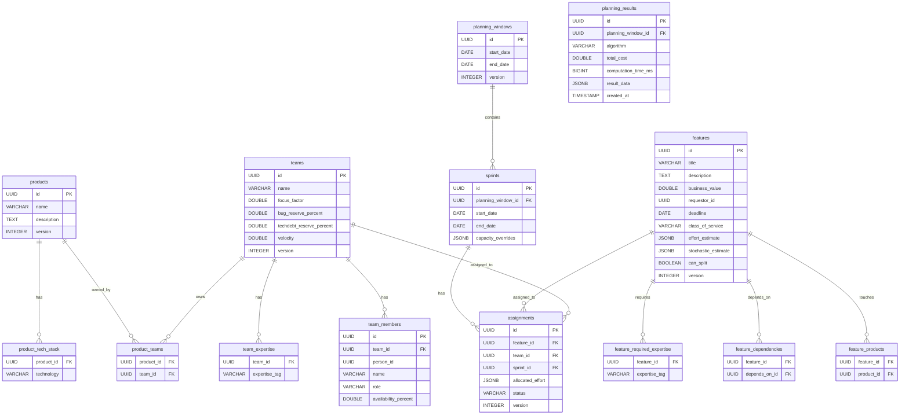

# Data Model — Спецификация

> PostgreSQL 16 схема. Flyway миграции.

---

## 1. ER Diagram



---

## 2. Tables

### 2.1 products

```sql
CREATE TABLE products (
    id UUID PRIMARY KEY DEFAULT gen_random_uuid(),
    name VARCHAR(255) NOT NULL,
    description TEXT,
    version INTEGER NOT NULL DEFAULT 0,
    created_at TIMESTAMP NOT NULL DEFAULT NOW(),
    updated_at TIMESTAMP NOT NULL DEFAULT NOW()
);

CREATE INDEX idx_products_name ON products(name);

CREATE TABLE product_tech_stack (
    product_id UUID NOT NULL REFERENCES products(id) ON DELETE CASCADE,
    technology VARCHAR(100) NOT NULL,
    PRIMARY KEY (product_id, technology)
);
```

### 2.2 teams

```sql
CREATE TABLE teams (
    id UUID PRIMARY KEY DEFAULT gen_random_uuid(),
    name VARCHAR(255) NOT NULL,
    focus_factor DOUBLE PRECISION NOT NULL DEFAULT 0.7,
    bug_reserve_percent DOUBLE PRECISION NOT NULL DEFAULT 0.20,
    techdebt_reserve_percent DOUBLE PRECISION NOT NULL DEFAULT 0.10,
    velocity DOUBLE PRECISION,
    version INTEGER NOT NULL DEFAULT 0,
    created_at TIMESTAMP NOT NULL DEFAULT NOW(),
    updated_at TIMESTAMP NOT NULL DEFAULT NOW()
);

CREATE INDEX idx_teams_name ON teams(name);

CREATE TABLE team_members (
    id UUID PRIMARY KEY DEFAULT gen_random_uuid(),
    team_id UUID NOT NULL REFERENCES teams(id) ON DELETE CASCADE,
    person_id UUID NOT NULL,
    name VARCHAR(255) NOT NULL,
    role VARCHAR(20) NOT NULL CHECK (role IN ('BACKEND', 'FRONTEND', 'QA', 'DEVOPS')),
    availability_percent DOUBLE PRECISION NOT NULL DEFAULT 1.0,
    UNIQUE(team_id, person_id)
);

CREATE INDEX idx_team_members_team ON team_members(team_id);
CREATE INDEX idx_team_members_role ON team_members(role);

CREATE TABLE team_expertise (
    team_id UUID NOT NULL REFERENCES teams(id) ON DELETE CASCADE,
    expertise_tag VARCHAR(100) NOT NULL,
    PRIMARY KEY (team_id, expertise_tag)
);
```

### 2.3 product_teams (many-to-many)

```sql
CREATE TABLE product_teams (
    product_id UUID NOT NULL REFERENCES products(id) ON DELETE CASCADE,
    team_id UUID NOT NULL REFERENCES teams(id) ON DELETE CASCADE,
    PRIMARY KEY (product_id, team_id)
);

CREATE INDEX idx_product_teams_team ON product_teams(team_id);
```

### 2.4 features

```sql
CREATE TABLE features (
    id UUID PRIMARY KEY DEFAULT gen_random_uuid(),
    title VARCHAR(500) NOT NULL,
    description TEXT,
    business_value DOUBLE PRECISION NOT NULL DEFAULT 0,
    requestor_id UUID,
    deadline DATE,
    class_of_service VARCHAR(20) NOT NULL DEFAULT 'STANDARD'
        CHECK (class_of_service IN ('EXPEDITE', 'FIXED_DATE', 'STANDARD', 'FILLER')),
    effort_estimate JSONB NOT NULL DEFAULT '{"backendHours":0,"frontendHours":0,"qaHours":0,"devopsHours":0}',
    stochastic_estimate JSONB,
    can_split BOOLEAN NOT NULL DEFAULT false,
    version INTEGER NOT NULL DEFAULT 0,
    created_at TIMESTAMP NOT NULL DEFAULT NOW(),
    updated_at TIMESTAMP NOT NULL DEFAULT NOW()
);

CREATE INDEX idx_features_deadline ON features(deadline) WHERE deadline IS NOT NULL;
CREATE INDEX idx_features_class_of_service ON features(class_of_service);
CREATE INDEX idx_features_business_value ON features(business_value DESC);
CREATE INDEX idx_features_effort ON features USING GIN(effort_estimate);
```

### 2.5 feature_products (many-to-many)

```sql
CREATE TABLE feature_products (
    feature_id UUID NOT NULL REFERENCES features(id) ON DELETE CASCADE,
    product_id UUID NOT NULL REFERENCES products(id) ON DELETE CASCADE,
    PRIMARY KEY (feature_id, product_id)
);

CREATE INDEX idx_feature_products_product ON feature_products(product_id);
```

### 2.6 feature_dependencies (self-referencing many-to-many)

```sql
CREATE TABLE feature_dependencies (
    feature_id UUID NOT NULL REFERENCES features(id) ON DELETE CASCADE,
    depends_on_id UUID NOT NULL REFERENCES features(id) ON DELETE CASCADE,
    PRIMARY KEY (feature_id, depends_on_id),
    CHECK (feature_id != depends_on_id)
);

CREATE INDEX idx_feature_dependencies_depends_on ON feature_dependencies(depends_on_id);
```

### 2.7 feature_required_expertise

```sql
CREATE TABLE feature_required_expertise (
    feature_id UUID NOT NULL REFERENCES features(id) ON DELETE CASCADE,
    expertise_tag VARCHAR(100) NOT NULL,
    PRIMARY KEY (feature_id, expertise_tag)
);
```

### 2.8 planning_windows & sprints

```sql
CREATE TABLE planning_windows (
    id UUID PRIMARY KEY DEFAULT gen_random_uuid(),
    start_date DATE NOT NULL,
    end_date DATE NOT NULL,
    version INTEGER NOT NULL DEFAULT 0,
    created_at TIMESTAMP NOT NULL DEFAULT NOW(),
    CHECK (end_date >= start_date)
);

CREATE TABLE sprints (
    id UUID PRIMARY KEY DEFAULT gen_random_uuid(),
    planning_window_id UUID NOT NULL REFERENCES planning_windows(id) ON DELETE CASCADE,
    start_date DATE NOT NULL,
    end_date DATE NOT NULL,
    capacity_overrides JSONB,
    CHECK (end_date >= start_date)
);

CREATE INDEX idx_sprints_window ON sprints(planning_window_id);
CREATE INDEX idx_sprints_dates ON sprints(start_date, end_date);
```

### 2.9 assignments

```sql
CREATE TABLE assignments (
    id UUID PRIMARY KEY DEFAULT gen_random_uuid(),
    feature_id UUID NOT NULL REFERENCES features(id) ON DELETE CASCADE,
    team_id UUID NOT NULL REFERENCES teams(id) ON DELETE RESTRICT,
    sprint_id UUID NOT NULL REFERENCES sprints(id) ON DELETE RESTRICT,
    allocated_effort JSONB NOT NULL DEFAULT '{"backendHours":0,"frontendHours":0,"qaHours":0,"devopsHours":0}',
    status VARCHAR(20) NOT NULL DEFAULT 'PLANNED'
        CHECK (status IN ('PLANNED', 'IN_PROGRESS', 'COMPLETED', 'LOCKED')),
    version INTEGER NOT NULL DEFAULT 0,
    created_at TIMESTAMP NOT NULL DEFAULT NOW(),
    updated_at TIMESTAMP NOT NULL DEFAULT NOW()
);

CREATE INDEX idx_assignments_feature ON assignments(feature_id);
CREATE INDEX idx_assignments_team ON assignments(team_id);
CREATE INDEX idx_assignments_sprint ON assignments(sprint_id);
CREATE INDEX idx_assignments_status ON assignments(status);
CREATE INDEX idx_assignments_team_sprint ON assignments(team_id, sprint_id);
CREATE INDEX idx_assignments_locked ON assignments(sprint_id) WHERE status = 'LOCKED';
```

### 2.10 planning_results (snapshots)

```sql
CREATE TABLE planning_results (
    id UUID PRIMARY KEY DEFAULT gen_random_uuid(),
    planning_window_id UUID REFERENCES planning_windows(id) ON DELETE SET NULL,
    algorithm VARCHAR(30) NOT NULL CHECK (algorithm IN ('GREEDY', 'SIMULATED_ANNEALING', 'MONTE_CARLO')),
    total_cost DOUBLE PRECISION NOT NULL,
    computation_time_ms BIGINT NOT NULL,
    result_data JSONB NOT NULL,
    created_at TIMESTAMP NOT NULL DEFAULT NOW()
);

CREATE INDEX idx_planning_results_window ON planning_results(planning_window_id);
CREATE INDEX idx_planning_results_created ON planning_results(created_at DESC);
CREATE INDEX idx_planning_results_algorithm ON planning_results(algorithm);
```

---

## 3. Flyway Migrations

```
src/main/resources/db/migration/
├── V1__initial_schema.sql
├── V2__add_external_ids.sql
├── V3__add_planning_results.sql
└── V4__add_audit_columns.sql
```

### V1__initial_schema.sql

```sql
-- All tables from section 2 above
```

### V2__add_external_ids.sql

```sql
ALTER TABLE features ADD COLUMN external_id VARCHAR(255);
ALTER TABLE features ADD COLUMN external_source VARCHAR(50);
ALTER TABLE teams ADD COLUMN external_id VARCHAR(255);
ALTER TABLE sprints ADD COLUMN external_id VARCHAR(255);

CREATE INDEX idx_features_external_id ON features(external_id) WHERE external_id IS NOT NULL;
CREATE INDEX idx_teams_external_id ON teams(external_id) WHERE external_id IS NOT NULL;
```

### V3__add_planning_results.sql

```sql
CREATE TABLE planning_results (
    id UUID PRIMARY KEY DEFAULT gen_random_uuid(),
    planning_window_id UUID REFERENCES planning_windows(id) ON DELETE SET NULL,
    algorithm VARCHAR(30) NOT NULL,
    total_cost DOUBLE PRECISION NOT NULL,
    computation_time_ms BIGINT NOT NULL,
    result_data JSONB NOT NULL,
    created_at TIMESTAMP NOT NULL DEFAULT NOW()
);

CREATE INDEX idx_planning_results_window ON planning_results(planning_window_id);
CREATE INDEX idx_planning_results_created ON planning_results(created_at DESC);
```

### V4__add_audit_columns.sql

```sql
ALTER TABLE products ADD COLUMN created_by VARCHAR(255);
ALTER TABLE products ADD COLUMN updated_by VARCHAR(255);
ALTER TABLE teams ADD COLUMN created_by VARCHAR(255);
ALTER TABLE teams ADD COLUMN updated_by VARCHAR(255);
ALTER TABLE features ADD COLUMN created_by VARCHAR(255);
ALTER TABLE features ADD COLUMN updated_by VARCHAR(255);
```

---

## 4. Useful Views

### 4.1 v_team_capacity

```sql
CREATE OR REPLACE VIEW v_team_capacity AS
SELECT
    t.id AS team_id,
    t.name AS team_name,
    t.focus_factor,
    t.bug_reserve_percent,
    t.techdebt_reserve_percent,
    tm.role,
    COUNT(tm.id) AS member_count,
    SUM(tm.availability_percent) AS total_availability
FROM teams t
LEFT JOIN team_members tm ON tm.team_id = t.id
GROUP BY t.id, t.name, t.focus_factor, t.bug_reserve_percent, t.techdebt_reserve_percent, tm.role;
```

### 4.2 v_feature_summary

```sql
CREATE OR REPLACE VIEW v_feature_summary AS
SELECT
    f.id,
    f.title,
    f.business_value,
    f.deadline,
    f.class_of_service,
    (f.effort_estimate->>'backendHours')::DOUBLE PRECISION AS backend_hours,
    (f.effort_estimate->>'frontendHours')::DOUBLE PRECISION AS frontend_hours,
    (f.effort_estimate->>'qaHours')::DOUBLE PRECISION AS qa_hours,
    (f.effort_estimate->>'devopsHours')::DOUBLE PRECISION AS devops_hours,
    COUNT(DISTINCT fp.product_id) AS product_count,
    COUNT(DISTINCT fd.depends_on_id) AS dependency_count,
    COUNT(DISTINCT a.id) AS assignment_count
FROM features f
LEFT JOIN feature_products fp ON fp.feature_id = f.id
LEFT JOIN feature_dependencies fd ON fd.feature_id = f.id
LEFT JOIN assignments a ON a.feature_id = f.id
GROUP BY f.id;
```

### 4.3 v_sprint_load

```sql
CREATE OR REPLACE VIEW v_sprint_load AS
SELECT
    s.id AS sprint_id,
    s.start_date,
    s.end_date,
    a.team_id,
    t.name AS team_name,
    COUNT(DISTINCT a.feature_id) AS feature_count,
    SUM((a.allocated_effort->>'backendHours')::DOUBLE PRECISION) AS backend_load,
    SUM((a.allocated_effort->>'frontendHours')::DOUBLE PRECISION) AS frontend_load,
    SUM((a.allocated_effort->>'qaHours')::DOUBLE PRECISION) AS qa_load,
    SUM((a.allocated_effort->>'devopsHours')::DOUBLE PRECISION) AS devops_load
FROM sprints s
JOIN assignments a ON a.sprint_id = s.id
JOIN teams t ON t.id = a.team_id
WHERE a.status != 'COMPLETED'
GROUP BY s.id, s.start_date, s.end_date, a.team_id, t.name;
```

---

## 5. Index Strategy

| Table | Index | Purpose |
|-------|-------|---------|
| features | `idx_features_deadline` | Быстрый поиск фич с дедлайнами |
| features | `idx_features_business_value DESC` | Сортировка по приоритету |
| features | `idx_features_effort GIN` | JSONB поиск по effort_estimate |
| assignments | `idx_assignments_team_sprint` | Загрузка команды в спринте |
| assignments | `idx_assignments_locked` | Быстрый поиск locked assignments |
| feature_dependencies | `idx_feature_dependencies_depends_on` | Поиск зависимостей |
| planning_results | `idx_planning_results_created DESC` | Последние планы |

---

## 6. JSONB Structures

### effort_estimate

```json
{
  "backendHours": 40,
  "frontendHours": 24,
  "qaHours": 16,
  "devopsHours": 8
}
```

### stochastic_estimate

```json
{
  "optimistic": 30,
  "mostLikely": 48,
  "pessimistic": 72
}
```

### capacity_overrides (sprint)

```json
{
  "team-uuid-1": {
    "hoursPerRole": {
      "BACKEND": 80,
      "FRONTEND": 60,
      "QA": 40,
      "DEVOPS": 20
    },
    "focusFactor": 0.6
  }
}
```

### result_data (planning_results)

```json
{
  "assignments": [...],
  "conflicts": [...],
  "featureTimelines": {...},
  "teamLoadReports": {...},
  "totalCost": 12345.67,
  "computationTimeMs": 15234,
  "algorithm": "SIMULATED_ANNEALING"
}
```

---

## 7. Тестовые данные (seed)

```sql
INSERT INTO products (id, name, description) VALUES
    ('00000000-0000-0000-0000-000000000001', 'Backend API', 'Core backend services'),
    ('00000000-0000-0000-0000-000000000002', 'Web App', 'Frontend web application'),
    ('00000000-0000-0000-0000-000000000003', 'Mobile App', 'iOS/Android application');

INSERT INTO teams (id, name, focus_factor) VALUES
    ('00000000-0000-0000-0000-000000000101', 'Team Alpha', 0.7),
    ('00000000-0000-0000-0000-000000000102', 'Team Beta', 0.75);

INSERT INTO team_members (team_id, person_id, name, role) VALUES
    ('00000000-0000-0000-0000-000000000101', '10000000-0000-0000-0000-000000000001', 'Alice', 'BACKEND'),
    ('00000000-0000-0000-0000-000000000101', '10000000-0000-0000-0000-000000000002', 'Bob', 'FRONTEND'),
    ('00000000-0000-0000-0000-000000000101', '10000000-0000-0000-0000-000000000003', 'Charlie', 'QA');

INSERT INTO product_teams (product_id, team_id) VALUES
    ('00000000-0000-0000-0000-000000000001', '00000000-0000-0000-0000-000000000101'),
    ('00000000-0000-0000-0000-000000000002', '00000000-0000-0000-0000-000000000101'),
    ('00000000-0000-0000-0000-000000000003', '00000000-0000-0000-0000-000000000102');
```
